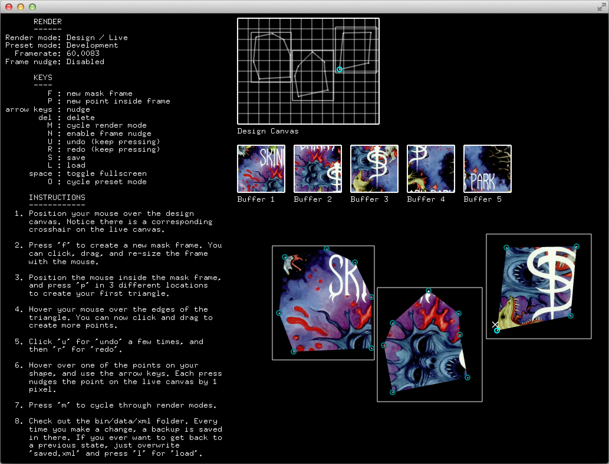

ofxProjectionMask
=================
ofxProjectionMask is an addon allowing you to mask projected light over real-world objects, from anything you draw in [openFrameworks](http://openframeworks.cc/).

Unlike projection mapping, this is not about creating the illusion that a light surface is 'mapped onto' a physical object; instead this addon simply prevents the light from 'bleeding' outside of the mask.

In other words, this addon separates out the [masking from the mapping](http://jahya.net/blog/?2014-10-projection-masking-not-projection), and only does the former without doing the latter. You can of course, still pre-transform your patterns in code if you want to achieve traditional projection mapping.

Why?
----
Sometimes you [don't want to map, you just want to mask](http://jahya.net/blog/?2014-10-projection-masking-not-projection). Sometimes you want the light to 'drape' over an object at it's original rendered resolution. Sometimes you want to transform the media in a way unrelated to it's masking. This addon is for those occasions.

Also, there is a difference in emphasis here. This isn't about 'creating an illusion', this is about experimenting with projected media in the form of light. From this perspective, things don't have to match up in the way we expect them to in the real world - in fact it's better if they don't.

How does it work?
-----------------
There is a design UI allowing you to slice out a shape with your mouse, representing some physical object within view of your projector. At the same time you can draw() anything you like into a pattern class that you will create, based on a template included in the addon.

The addon has full instructions and samples in the example project, along with information about running fullscreen/dualscreen.

Project dependencies
--------------------
- [ofxTriangle](https://github.com/obviousjim/ofxTriangle) to build renderable triangles out of the points in your mask
- [ofxSecondWindow](https://github.com/genekogan/ofxSecondWindow) to allow for a dualscreen setup with a projector
- [ofxXmlSettings](http://www.openframeworks.cc/documentation/ofxXmlSettings/ofxXmlSettings.html) to store masks as you draw them - it's part of the openFrameworks core
- Tested against [openFrameworks 0.8.4](http://openframeworks.cc/download/)

With thanks
-----------
This codebase was created with support from [I-Park Foundation](http://www.i-park.org/) and the [Contemporary Artist Center](http://www.cactroy.org/).